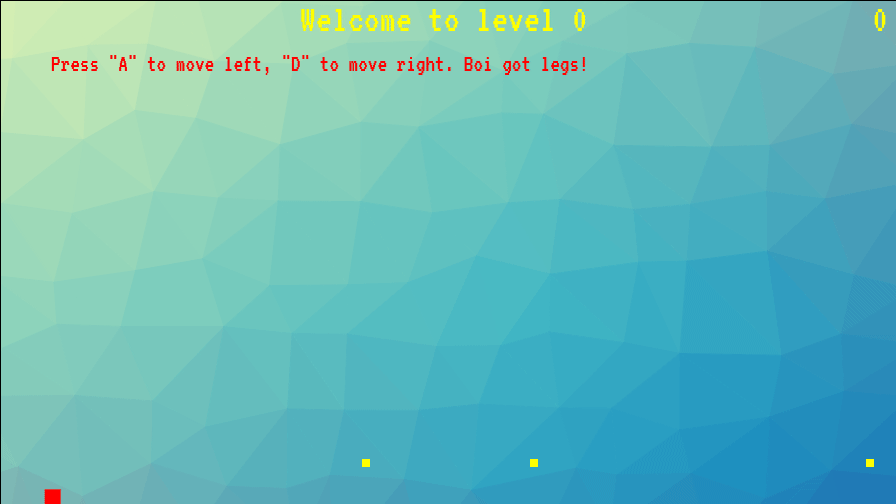

# SquareBoi
## A platformer guiding our Square Boi through a series of levels

[Live](http://brianliew.com/SquareBoi/)

### Background
SquareBoi is a 2D puzzle platformer where a player controls our boi, navigating past a set of unique levels in order to collect his precious coins. To gather his coins, our boi will need to climb walls and bounce from platform to platform in order to progress to the next level.

### Controls
* W: Jump
* A: Move Left
* D: Move Right
* R: Restart Level

### Functionality & How to play
* Collect the yellow coins to advance to the next level
* Climb walls by holding the Jump key and the direction against the wall
* Fall from the top of the screen onto the floor and see what happens!
* If you fall off the screen, don't panic! Just press the 'R' key!

### Architecture and Technologies
This project will be implemented with the following technologies:

- `JavaScript` for game logic,
- `HTML5 Canvas` to render our boi and the platform levels,
- `Webpack` to bundle js files.

### Future Implementations
There are additional features that I would like to implement for Square Boi.
- [ ] Add moving platforms or shifting platform shapes
- [ ] Add improved player physics
- [ ] Additional levels
